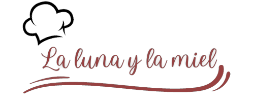

# Restaurante La luna y la miel :spaghetti:

Landing page para proyecto integrador front de Codo a Codo 4.0.

:computer: Diseño resposive para distintos dispositivos.

:clock9: Ingresá y hacé tu reserva [aquí](https://brianfloresok.github.io/la-luna-y-la-miel/)

## Tecnologías utilizadas

+ HTML
+ CSS
+ Javascript
+ [Bootstrap](https://getbootstrap.com/)
+ [Swiper](https://swiperjs.com/)
